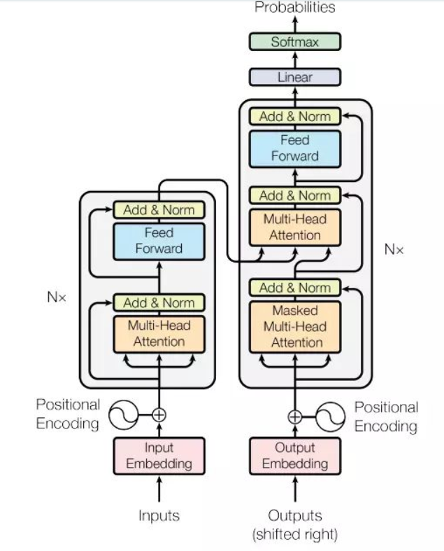
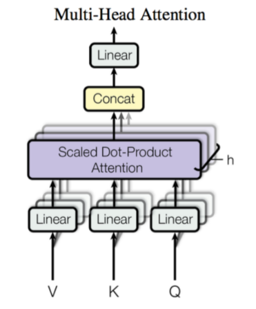
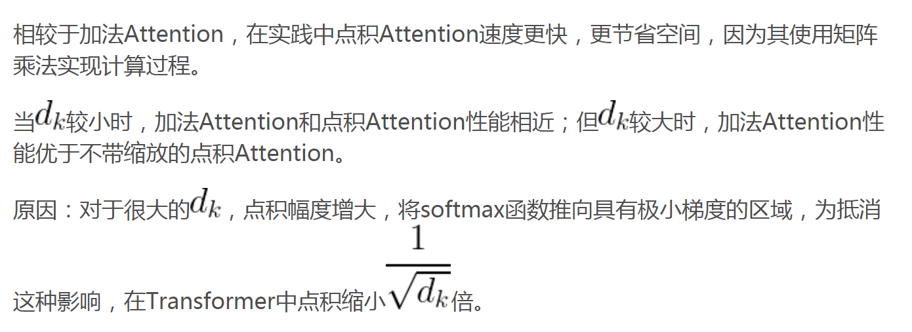
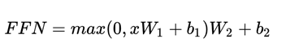

# Transformers

Transformer是谷歌在2017年发布的一个用来替代RNN和CNN的新的网络结构，Transformer本质上就是一个Attention结构，它能够直接获取全局的信息，而不像RNN需要逐步递归才能获得全局信息，也不像CNN只能获取局部信息，并且其能够进行并行运算，要比RNN快上很多倍。



### 1、Encoder和Decoder结构

Encoder: 这里面有 N=6个 一样的layers, 每一层包含了两个sub-layers. 第一个sub-layer 就是多头注意力层（multi-head attention layer） 然后是一个简单的全连接层。

Multi-Head Self-Attention

Position-Wise Feed-Forward Network \(全连接层\)

Encoder: 输入由 Input Embedding 和 Positional Embedding 求和组成，这里还有一个残差连接 （residual connection\), 在这个基础上， 还有一个layer norm.。  
Decoder: 这里同样是有六个一样的Layer是，但是这里的layer 和encoder 不一样， 这里的layer 包含了三个sub-layers,  其中有 一个self-attention layer, encoder-decoder attention layer 最后是一个全连接层。

Multi-Head Self-Attention

Multi-Head Context-Attention

Position-Wise Feed-Forward Network

前两个sub-layer 都是基于multi-head attention layer.  这里有个特别点就是masking,  masking 的作用就是防止在训练的时候 使用未来的输出的单词。 比如训练时， 第一个单词是不能参考第二个单词的生成结果的。 Masking就会把这个信息变成0， 用来保证预测位置 i 的信息只能基于比 i 小的输出。Decoder 的初始输入由 Output Embedding 和 Positional Embedding 求和得到。

### 2、Multi-Head Self-Attention



关于使用缩放dk的原因：



### 3、Position-wise Feed-Forward network

这是一个全连接网络，包含两个线性变换和一个非线性函数 \(实际上就是 ReLU\)。公式如下:



这个线性变换在不同的位置都表现地一样，并且在不同的层之间使用不同的参数。

这里实现上用到了两个一维卷积。

残差网络：

残差网络有什么好处呢？显而易见：因为增加了 x 项，那么该网络求 x 的偏导的时候，多了一项常数 1，所以反向传播过程，梯度连乘，也不会造成梯度消失。

### 4、Positional embedding

因为 Transformer 利用 Attention 的原因，少了对序列的顺序约束，这样就无法组成有意义的语句。为了解决这个问题，Transformer 对位置信息进行编码。


pos 指词语在序列中的位置，偶数位置，使用正弦编码，奇数位置，使用余弦编码。

上述公式解释：给定词语的位置 pos，我们可以把它编码成 d\_model 维的向量！也就是说，位置编码的每一个维度对应正弦曲线，波长构成了从 到 的等比序列。

上面的位置编码是绝对位置编码。但是词语的相对位置也非常重要。这就是论文为什么要使用三角函数的原因！

正弦函数能够表达相对位置信息


### 5、两种Normalization  layer

Normalization 有很多种，但是它们都有一个共同的目的，那就是把输入转化成均值为 0 方差为 1 的数据。我们在把数据送入激活函数之前进行 Normalization（归一化），因为我们不希望输入数据落在激活函数的饱和区。

在深层网络训练过程中，由于网络中参数变化而引起内部节点数据分布发生变化的这一过程被称作 Internal Covariate Shift。（内部协变量偏移）

BN 就是为了解决这一问题，一方面可以简化计算过程，一方面经过规范化处理后让数据尽可能保留原始表达能力。

BN 的主要思想是：在每一层的每一批数据上进行归一化。

  
  
  LN 是**在每一个样本上计算均值和方差，而不是 BN 那种在批方向计算均值和方差**


**为什么用layer normalization而不是batch normalization**


### 6、两种mask

Transformer 模型里面涉及两种 Mask。分别是 Padding Mask 和 Sequence Mask。

其中，Padding Mask 在所有的 Scaled Dot-Product Attention 里面都需要用到，而 Sequence Mask 只有在 Decoder 的 Self-Attention 里面用到。

**Padding Mask**

什么是 Padding Mask 呢？回想一下，我们的每个批次输入序列长度是不一样的。我们要对输入序列进行对齐！就是给在较短的序列后面填充 0。因为这些填充的位置，其实是没什么意义的，所以我们的 Attention 机制不应该把注意力放在这些位置上，所以我们需要进行一些处理。

具体的做法是，把这些位置的值加上一个非常大的负数\(负无穷\)，这样的话，经过 Softmax，这些位置的概率就会接近 0 ！

而我们的 Padding Mask 实际上是一个张量，每个值都是一个 Boolen，值为 False 的地方就是我们要进行处理的地方。

```text
def padding_mask(seq_k, seq_q):
```

```text
    # seq_k 和 seq_q 的形状都是 [B,L]
```

```text
    len_q = seq_q.size(1)
```

```text
    # `PAD` is 0
```

```text
    pad_mask = seq_k.eq(0)
```

```text
    # shape [B, L_q, L_k]
```

```text
    pad_mask = pad_mask.unsqueeze(1).expand(-1, len_q, -1)  
```

```text
    return pad_mask
```

**Sequence mask**

文章前面也提到，Sequence Mask 是为了使得 Decoder 不能看见未来的信息。也就是对于一个序列，在 time\_step 为 t 的时刻，我们的解码输出应该只能依赖于 t 时刻之前的输出，而不能依赖 t 之后的输出。因此我们需要想一个办法，把 t 之后的信息给隐藏起来。

那么具体怎么做呢？也很简单：产生一个上三角矩阵，上三角的值全为 1，下三角的权值为 0，对角线也是 0。把这个矩阵作用在每一个序列上，就可以达到我们的目的啦。

本来 Mask 只需要二维的矩阵即可，但是考虑到我们的输入序列都是批量的，所以我们要把原本 2 维的矩阵扩张成 3 维的张量。

def sequence\_mask\(seq\):

    batch\_size, seq\_len = seq.size\(\)

    mask = torch.triu\(torch.ones\(\(seq\_len, seq\_len\), dtype=torch.uint8\),diagonal=1\)

    mask = mask.unsqueeze\(0\).expand\(batch\_size, -1, -1\)  \# \[B, L, L\]

    return mask

  
 对于decoder的self-attention，里面使用到的scaled dot-product attention，同时需要padding mask 和 sequence mask 作为 attn\_mask，具体实现就是两个 mask 相加作为attn\_mask，其他情况，attn\_mask 一律等于 padding mask。

